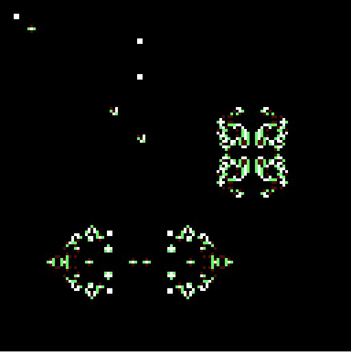

# Conway's Game of Life

This is a simple implementation of Conway's "Game Of Life".  
It uses the basic rule set and currently runs without parallelization.  
Computation on multiple threads might be added in the future.  

